# Hotel Booking Analytics Dashboard

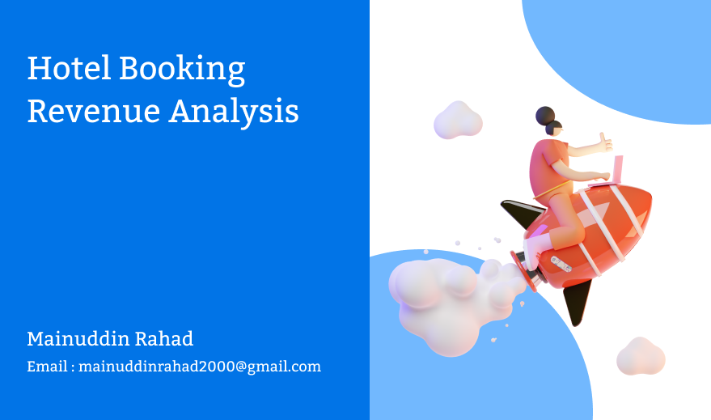

# 📌 Project Overview

This project aims to analyze hotel booking data to derive valuable business insights using **SQL and Power BI.** The dataset consists of multiple tables containing hotel information, booking trends, customer ratings, and revenue data. The analysis focuses on **occupancy rates, revenue trends, customer behavior, and booking platform performance.**

# 🎯 Objectives

#### 🔹 Identify key revenue drivers for Luxury and Business hotels.

#### 🔹 Analyze occupancy rates, booking trends, and seasonal impacts.

#### 🔹 Evaluate booking platform performance and guest preferences.

#### 🔹 Assess revenue loss due to cancellations and provide actionable recommendations.

#### 🔹 Visualize findings in an interactive Power BI dashboard for strategic decision-making.

# Dataset Description

The project is based on five primary datasets:

- **dim_date:** Contains date-related details such as week number, day type (weekend/weekday), and formatted date.

- **dim_hotels:** Contains details about hotel properties, including hotel name, category (Luxury/Business), and city.

- **dim_rooms:** Defines room types and their classification (Standard, Elite, Premium, Presidential).

- **fact_aggregated_bookings:** Contains aggregated booking data with check-in dates, room categories, successful bookings, and capacity.

- **fact_bookings:** Stores detailed booking information, including booking status, customer details, and platform details.


# ERD (Entity Relationship Diagram) Overview

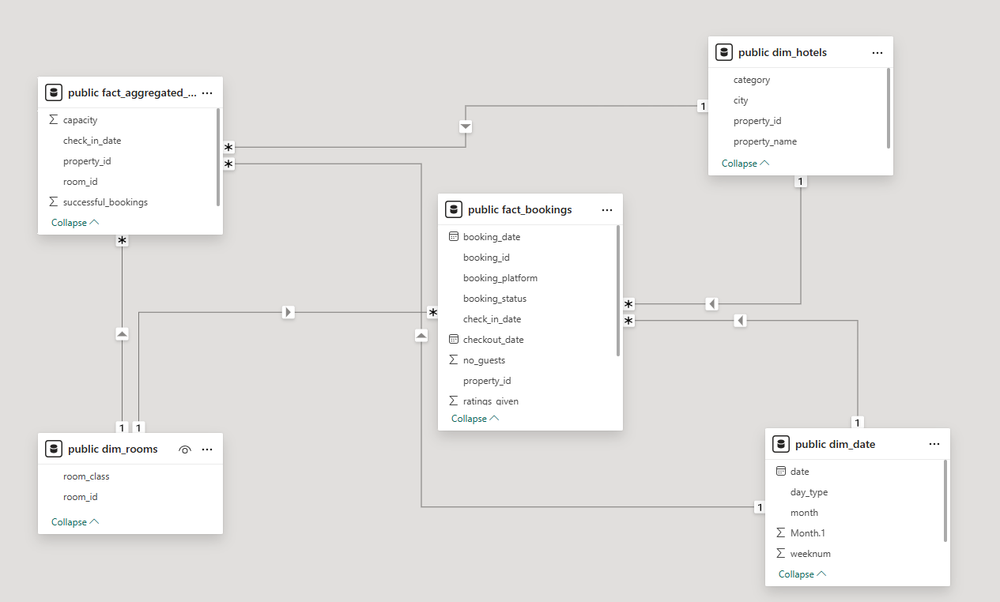

# Tools and Technology I Used

- SQL: The backbone of my analysis, allowing me to query the database and unearth critical insights.

- PostgreSQL: The chosen database management system, ideal for handling the job posting data.

- Visual Studio Code: My go-to for database management and executing SQL queries.

- Git & GitHub: Essential for version control and sharing my SQL scripts and analysis, ensuring collaboration and project tracking.

- Power BI: I can use these to create a greate visual to my **SQL query result** and **final Dashboard report.**


# 📌 SQL Analysis & Insights

## 1️⃣ Revenue Analysis

- ✅ Which hotel category (Luxury or Business) generates the highest revenue per successful booking?

```sql
SELECT
    dim_hotels.category AS hotel_category,
    Round(
        (
            (sum(fact_bookings.revenue_realized) :: Decimal)/1000000
        )
        ,2) AS revenue_in_millions
FROM
    fact_bookings
    LEFT JOIN dim_hotels
    ON fact_bookings.property_id = dim_hotels.property_id
GROUP BY hotel_category;
```
## Revenue Distribution:
- **Luxury Hotels:** Generated **$1,052.75 million** in revenue.

- **Business Hotels:** Generated **$656.02 million** in revenue.

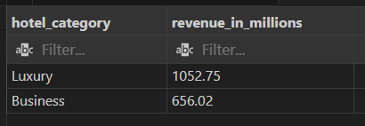

For better visualization Also I can added a column chart.


## 2️⃣ Occupancy Rate Analysis

- ✅ What is the average occupancy rate per hotel and room type?

```sql
SELECT
    dim_hotels.property_name AS hotel_name,
    dim_rooms.room_class AS room_type,
    CAST(
        ((sum(successful_bookings) / sum(capacity))*100) AS DECIMAL(10,0)
        ) AS occupancy_rate_percentage
FROM
    fact_aggregated_bookings
    LEFT JOIN dim_hotels
    ON fact_aggregated_bookings.property_id = dim_hotels.property_id
    LEFT JOIN dim_rooms
    ON fact_aggregated_bookings.room_id = dim_rooms.room_id
GROUP BY hotel_name , room_type
ORDER BY hotel_name ASC 
```
## 🔑 Key Insights from Occupancy Rate Analysis
- ### 🏨 Hotel-Wise Performance
- ✅ **Top Performing Hotel:** **Atliq Blu (🔥 62% average occupancy across all room types)** → High demand across categories.

- ✅ **Consistent Performers:** **Atliq Bay, Atliq City, and Atliq Palace (~58-61% occupancy)** → Steady customer demand and booking trends.

- ✅ **Lowest Performing Hotel:** **Atliq Seasons (44-45% occupancy)** → Low demand across all room categories, requiring marketing & pricing strategy adjustments.

### 🛏️ Room Type Performance
- ✅ **Presidential Rooms Lead:** Highest **occupancy (61-63%)**, suggesting premium customers prefer luxury & exclusivity.

- ✅ **Standard & Premium Rooms:** Show similar occupancy **(57-60%)**, indicating a preference for comfort over budget options.

- ✅ **Atliq Blu's Unique Consistency:** All room types maintain **62% occupancy**, indicating a balanced room demand strategy.

### Here's the SQL query result and charts for better visualization.

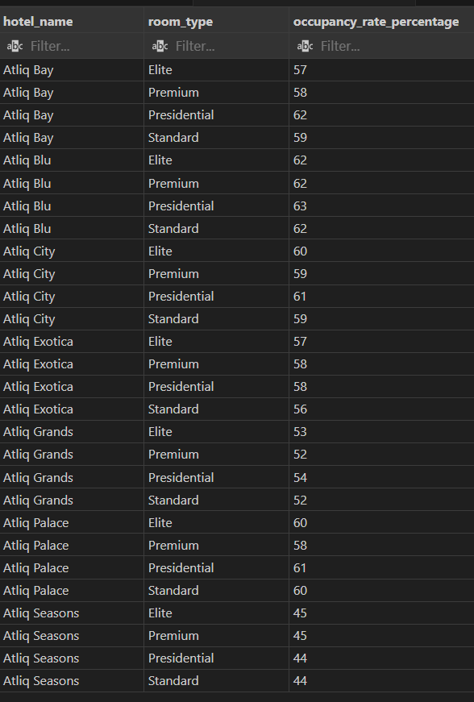

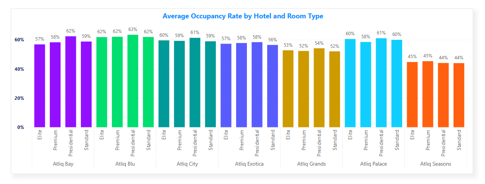


## 3️⃣ Peak Booking Periods
- ✅ Which week and day type see the highest number of bookings?

```sql
SELECT
    dim_date.weeknum AS week_num,
    dim_date.day_type AS day_type,
    count(booking_id) AS number_of_bookings
FROM
    fact_bookings
    LEFT JOIN dim_date
    ON fact_bookings.check_in_date = dim_date.date
GROUP BY week_num , day_type
ORDER BY week_num ASC
```

- Weekdays consistently have higher bookings than weekends across all weeks.

- The highest number of weekday bookings: **Week 29 (7,616 bookings)**.

- The lowest number of weekday bookings (excluding incomplete data in week 32): **Week 30 (6,197 bookings).**

- The highest number of weekend bookings: **Week 24 (3,433 bookings)**.

- The lowest number of weekend bookings: **Week 30 (2,823 bookings)**.

### Final Answer:

- ✅ Week with Highest Bookings: Week 24 (11,041 bookings)

- ✅ Week with Lowest Bookings: Week 31 (9,021 bookings)


## 4️⃣ Booking Platform Performance

- ✅ Which platform has the highest booking conversion rate (Booking → Check-in)?

```sql
SELECT
    booking_platform,
    count(
    CASE
        WHEN booking_status IN ('Checked Out' , 'No Show') THEN booking_id
    END) AS successful_check_in,
    count(booking_id) AS total_bookings,
    round(((count(
    CASE
        WHEN booking_status IN ('Checked Out' , 'No Show') THEN booking_id
    END) :: DECIMAL) / (count(booking_id) :: DECIMAL)* 100),2)AS conversion_rate,
    round(((count(
    CASE
        WHEN booking_status IN ('Cancelled') THEN booking_id
    END) :: DECIMAL) / (count(booking_id) :: DECIMAL)* 100) ,2)AS cancelation_rate
FROM
    fact_bookings
GROUP BY booking_platform
```

### 🔑 Key Insights from Conversion & Cancellation Rates Analysis
- ### 📈 Conversion Rate Insights
- ✅ Overall Stability: Conversion rates across platforms remain consistent **(75%)**, indicating a reliable booking experience.

- ✅ Best Performing Platform: **Logtrip (75.70%)** → Highest conversion rate, suggesting it offers better user experience, trust, or promotional benefits.

- ✅ Lowest Performing Platform: **Direct Online (75.01%)** → Slightly lower conversion rate, possibly due to user friction, pricing, or trust factors.

- ### 📉 Cancellation Rate Insights
- ✅ Stable Cancellation Trends: Rates range from **24.5% to 25%**, meaning 1 in 4 bookings is canceled.

- ✅ Best Cancellation Rate: **Logtrip (24.30%)** → Lowest cancellations, aligning with its highest conversion rate (indicating higher customer commitment).

- ✅ Highest Cancellation Rate: **Others (24.99%)** → Marginally higher cancellation rate, possibly due to less user-friendly policies or pricing fluctuations.

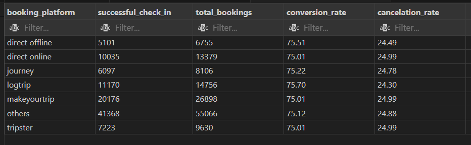

For better visulization:

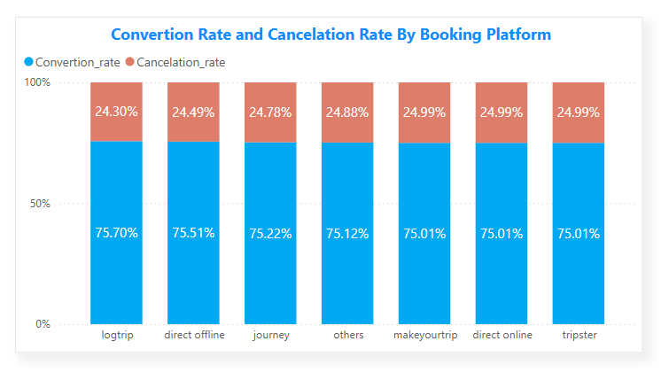


## 4. Guest Behavior :

- ✅ Which room category is the most preferred by guests in different hotel categories?

```sql
SELECT
    dim_hotels.category AS hotel_category,
    dim_rooms.room_class AS room_category,
    count(booking_id) AS number_of_bookings
FROM
    fact_bookings
    LEFT JOIN dim_hotels
    ON fact_bookings.property_id = dim_hotels.property_id
    LEFT JOIN dim_rooms
    ON fact_bookings.room_id = dim_rooms.room_id
GROUP BY hotel_category , room_category
ORDER BY hotel_category ASC;
```

### 🔑 Key Insights from Room Category Performance
- ### 🏨 Business Hotels

- ✅ Most Popular Room Type: **Elite Rooms (18,932 bookings)**

- ✅ **Standard Rooms (14,480 bookings)** → Second most booked rooms.

- ✅ **Presidential Rooms (6,991 bookings)** → Least booked, likely due to higher pricing and niche customer base.


- ### 🏨 Luxury Hotels

- ✅ Most Popular Room Type: **Elite Rooms (30,573 bookings)** 

- ✅ **Standard Rooms (23,966 bookings)** → Also in high demand.

- ✅ **Presidential Rooms (9,082 bookings)** → Least booked, consistent with business hotels, showing limited affordability and selective clientele.

Finally we can see that **luxury hotels and Business hotels** both , **Elite and Standard rooms** attract the most bookings.

**Presidential rooms** have the lowest demand in both hotel categories, likely due to high prices and limited affordability probably.

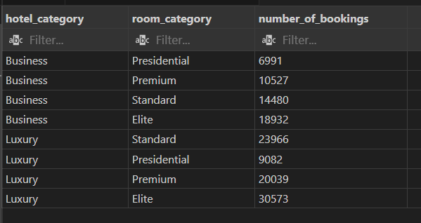

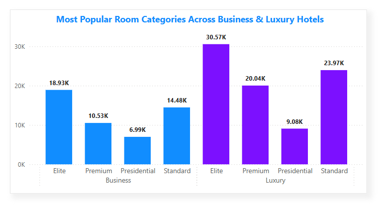

## 6. City-Wise Hotel Performance:

- ✅Which city has the highest revenue for hotels?

```sql
SELECT
    dim_hotels.city AS city,
    dim_hotels.property_name AS hotel_name,
    CAST(
        ((sum(fact_bookings.revenue_realized) :: DECIMAL) / 1000000)
        AS DECIMAL(10,2)
     )AS revenue_in_millions
FROM
    fact_bookings
    LEFT JOIN dim_hotels
    ON fact_bookings.property_id = dim_hotels.property_id
GROUP BY city , hotel_name
```

### Here's the breakdown of my query analysis.

- ### Bangalore:

- 📈 **Atliq Bay (₹82.44M) and Atliq City (₹81.88M)** are the highest revenue-generating hotels.

- **Atliq Grands (₹54.49M)** has the lowest revenue in Bangalore.

- ### Delhi:

- 💰 **Atliq Palace (₹89.14M)** leads in revenue, significantly ahead of others.

- Atliq Grands (₹36.06M) earns the least in Delhi, showing lower demand.

- ### Hyderabad:

- 🔝 **Atliq Bay (₹69.26M)** generates the highest revenue.

- **Atliq Palace (₹44.84M)** has the lowest revenue.

- ### Mumbai:

- 🚀 **Atliq Exotica (₹212.44M)** dominates with the highest revenue across all cities.

- **Atliq City (₹88.00M)** and **Atliq Palace (₹101.51M)** also perform well.

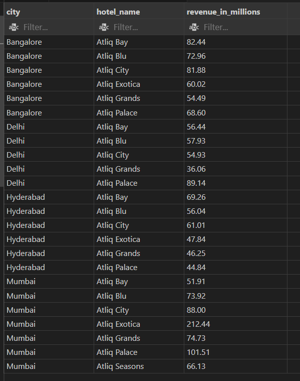
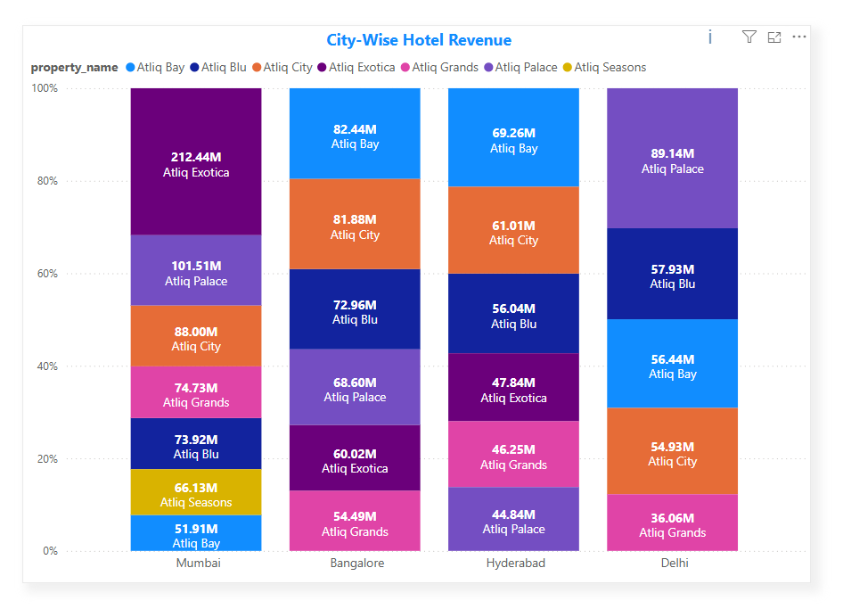


## 7. Revenue Leakage Due to Cancellations:

✅ How much revenue is lost due to cancellations?

```sql
SELECT
    CAST(
        (((sum(revenue_generated) - sum(revenue_realized)) :: DECIMAl) / 1000000 ) AS DECIMAL(10,2)
    )AS revenue_lack_in_millions
FROM
    fact_bookings
```
- **During cancellation we have $298.77M revenue lost.**

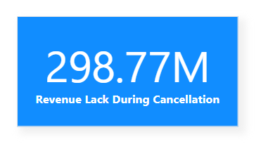

## 8. Customer Ratings Analysis:

- ✅Which factors impact customer ratings, and how do ratings vary across hotels and cities?

```sql
SELECT
    city,
    CAST((sum(revenue_realized):: DECIMAL / 1000000) AS DECIMAL(10,2)) AS total_revenue_in_millions,
    CAST(avg(ratings_given) AS DECIMAl(10,2)) AS average_rating
FROM
    fact_bookings
    LEFT JOIN dim_hotels
    ON fact_bookings.property_id = dim_hotels.property_id
GROUP BY city ;
```
### Insights from the Chart: "Impact of Revenue on Customer Ratings Across Hotels & Cities"

- ### Mumbai Generates the Highest Revenue:

    - The **purple bubble (Mumbai**) is positioned at the highest revenue level **($668.64M)**, indicating that Mumbai hotels generate the most revenue despite an average customer rating of around **3.65.**

    - This suggests that revenue does not necessarily correlate with the highest ratings.


- ### Bangalore has Strong Revenue but Lower Ratings:

    - The **blue bubble (Bangalore)** has the second-highest revenue ($420.40M) but the lowest customer rating **(3.41).**

    - This indicates a potential issue with customer satisfaction despite strong revenue generation.


- ### Delhi Achieves the Highest Customer Rating:

    - The **blue bubble (Delhi)** is positioned at the highest rating **(3.78)** while having a moderate **revenue ($294.50M).**

    - This suggests that customers in **Delhi** are more satisfied with hotel services, even if revenue isn’t the highest.
        

- ### Hyderabad Balances Revenue and Ratings:

    - **The orange bubble (Hyderabad)** has moderate **revenue ($325.23M)** and a decent **rating (3.66).**


- **This suggests a balance between revenue generation and customer satisfaction, possibly indicating efficient service management.**

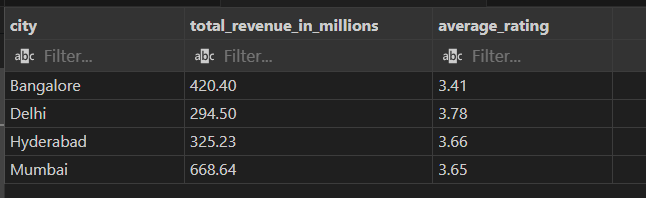

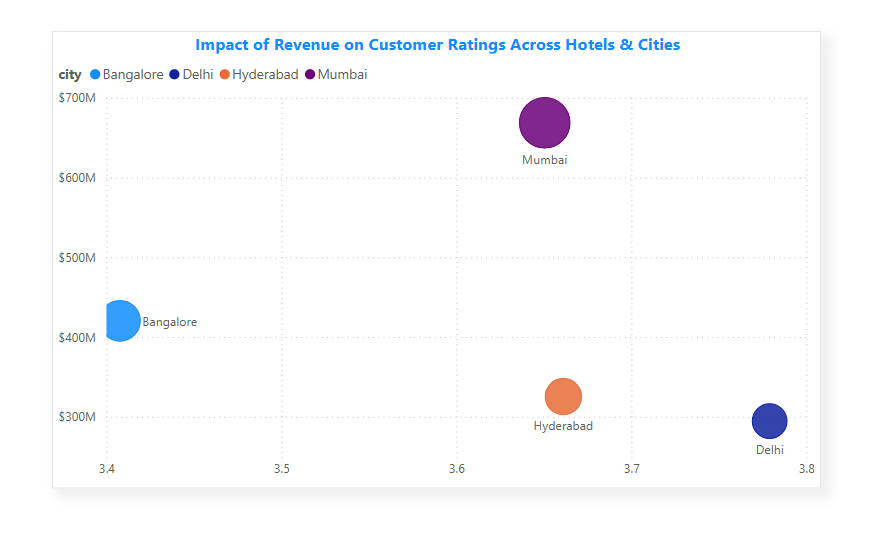

# 📊 Power BI Dashboard Features & Visuals

## 📌 Key KPIs 

**✔ Total Bookings**

**✔ Total Revenue**

**✔ Total Occupancy Rate (%)**

**✔ Total Cancellation Rate (%)**

**✔ Total Successful Booking Rate (%)**

**✔ Revenue Lack During Cancellation**

## 📌 Power BI Visuals

**✅ Revenue Trend Analysis → Line Chart (Total Revenue over Weeknum and Day_tpe -> (Weekday vs Weekend) )**

**✅ Booking Trends Analysis → Line Chart (Total Bookings over Weeknum and Day_tpe -> (Weekday vs Weekend) )**

**✅ Booking Trends By Booking Status → Donut Chart (Successful vs No Show vs Cancalled)**

**✅ Revenue By Hotel Category  →  Stacked Column Chart (Luxury vs Business)**

**✅ Customer Ratings Analysis → Scatter Plot (Ratings vs. Revenue vs. City)**

**✅ Most Popular Room Categories → Clustered Column Chart ( Luxury vs Business)**

**✅ Revenue Loss During Cancelation  →  Pie Chart**

## Here's The Final Dashboard 

### Page - 1

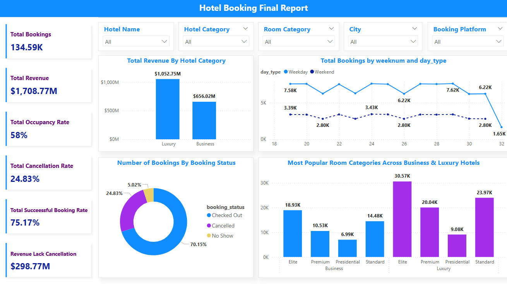

### Page - 2

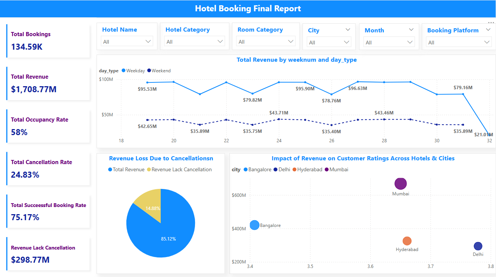

# 📝 Summary

**📌 Industry: Hospitality (Hotel Revenue Management)**

**📌 Key Focus: Revenue, Occupancy, Booking Trends, Customer Ratings**

**📌 Tools Used: SQL, Power BI , Excel**

**📌 Deliverable: Interactive Power BI Dashboard + SQL Insights**


# 🎯 Final Thoughts

This project demonstrates data-driven decision-making in hotel revenue management using SQL and Power BI. By identifying booking trends, revenue leakage, and customer preferences, AtliQ Grands can improve its market position and boost revenue performance.